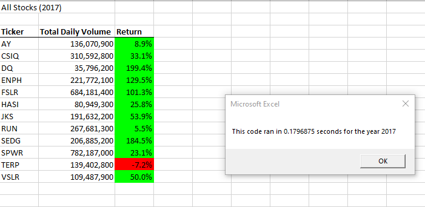
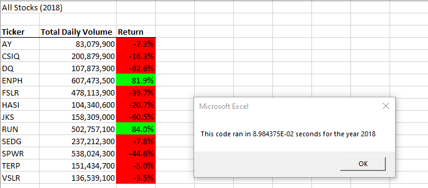

#Stocks-Analysis

##Overview of Project: Explain the purpose of this analysis.
We are refactoring VBA code to make the script run faster. Initially it was used to run an analysis for one ticker for years 2017 and 2018. Now the VBA script expands into the entire dataset and will still take a fraction of a second to run.

##Results: Using images and examples of your code, compare the stock performance between 2017 and 2018, as well as the execution times of the original script and the refactored script.
Stocks generally performed better in 2017 than 2018. There were more positive returns in 2017 than 2018. It also took less time for the code to run for the 2017 dataset tahn 2018 data set.
There is also a slight difference in the total daily volume for each ticker for both years. However, the trend of the return would not be affected by the difference in volumes between the years. 
Based on the results, Steve's parents should invest in either ENPH or RUN since both tickers yielded positive returns for two consecutive years.
  

###Summary: In a summary statement, address the following questions.

- What are the advantages or disadvantages of refactoring code?
Advantages would be that you do not need to think of a brand new code to work out the function. There is already a workable code and that leaves room for experimenting to improve. 
There is at least a fallback should the refactored code not work out. Refactoring is meant to improve the current design and make it easier to understand and find ways to execute the program faster.

Disadvantages would be creating issues to the current active code. Refactoring can create bugs that were non existent until then. When the current program/code is lengthy, refactoring may have some drawbacks because it can change the output if the coder does not understand the original code/program.

- How do these pros and cons apply to refactoring the original VBA script?
Luckily, we only needed to add one loop to the original VBA script to make it analyze more than just the original DQ ticker so it did not require much change to the original script.
Since there is so much data, there were always possible issues of receiving errors for changes made. 
However, now that we have successfully refactored, Steve and his parents can now just add a new sheet for each year and re-run the program to get data on each year easily.

